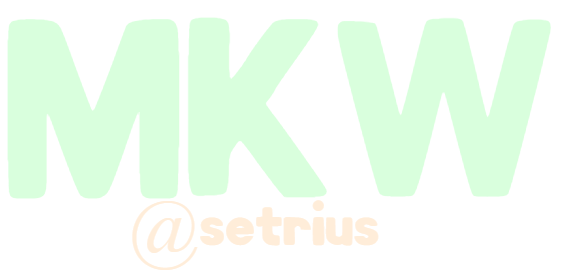

<div align="center">
    
    <hr>
    <h1><code>@0.1.1</code></h1>
</div>

# MKW
MKW, or **M**ulti-**K**ey**w**ord, is a simple package that allows you to use the same method name multiple times. It determines which method to use based on the provided parameters in classes.

```js
const mkw = require("mkw");
const vessel = new mkw({
    name: "say",
    functions: [
        {
            fn: (string) => {
                console.log("STRING:", string);
                return this;
            },

            parameters: ["String"],
        },
        {
            fn: (number) => {
                console.log("NUMBER:", number);
                return this;
            },

            parameters: ["Number"],
        },
        {
            fn: (boolean) => {
                console.log("BOOLEAN:", boolean);
                return this;
            },

            parameters: ["Boolean"],
        }
    ]
});

new vessel()
    .say("Hello world!") // STRING: Hello world!
    .say(14) // NUMBER: 14
    .say(true) // BOOLEAN: true
```

# Installing
```js
npm i mkw
const mkw = require("mkw");
import mkw from "mkw";
```

# Parameter Types
These are what you would put in the `parameters[]` array for each function. **They must be properly capitalized, and must be Strings.**
> - `"String"`
> - `"Boolean"`
> - `"Number"`
> - `"BigInt"`
> - `"Symbol"`
> - `"Function"`
> - `"Array"`
> - `"Object"`
> - **Any Class**

# Changelog
## `mkw@0.1.1`
> - Added support for custom classes as a Parameter Type.

# Resources
> - [GitHub](https://github.com/setriusdev/mkw)
> - [NPM](https://npmjs.com/package/mkw)
> - [Documentation](https://docs.setrius.com/mkw) (**Unreleased**)

# Info
Latest: `@0.1.1` on `9/16/2022`<br>
By: `@itsatelo`<br>
Dependencies:
- `atils@2.0.2`
